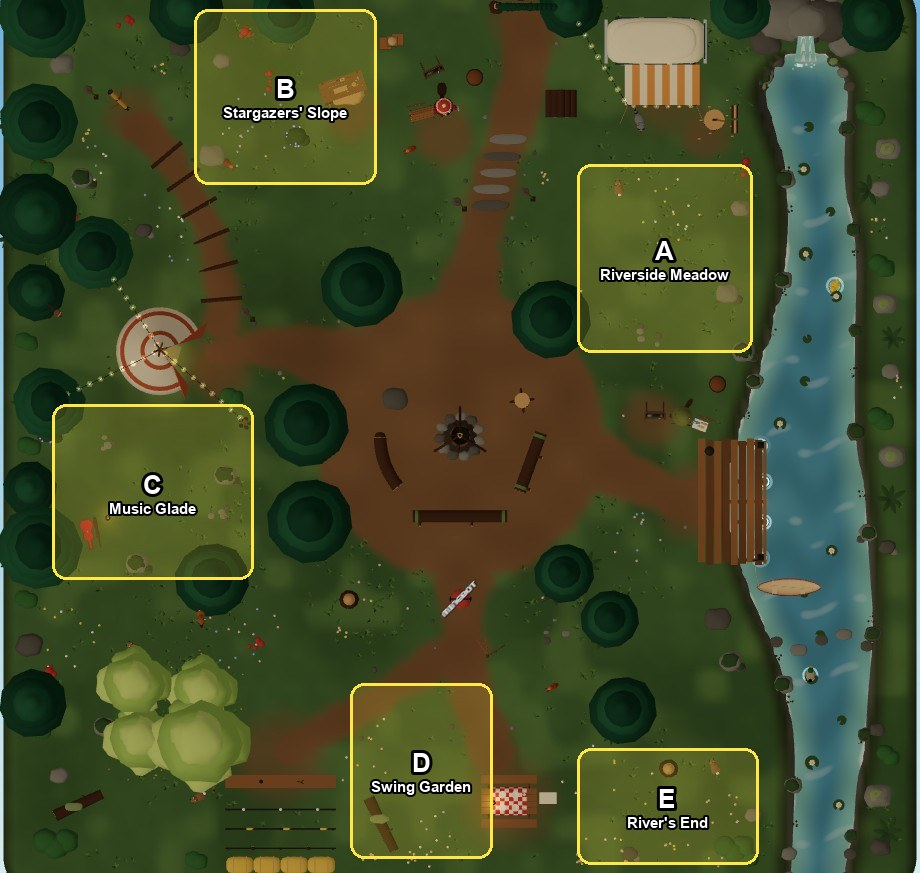
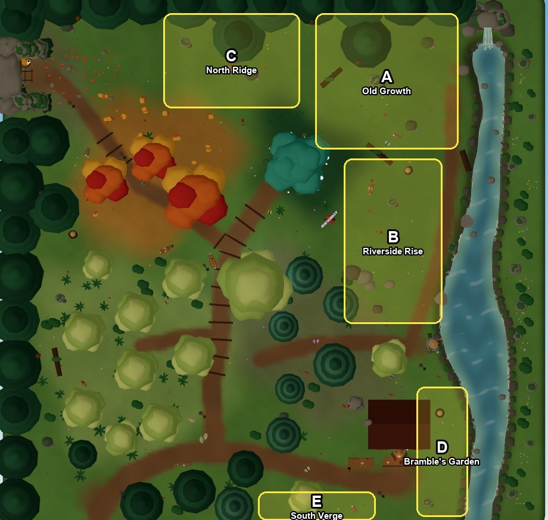

# Filling the campfire and the woods: design

Status: **approved 2026-10-02** with the recommended answers (fill, places only and no coins, the
brook built, both maps part by part, the beach on hold). Built so far: **part 1, mass** (patch
0.7.45) and **part 2, the campfire's places** (patch 0.7.46). What moved from the plan is at the foot of this document.

## The problem, measured

Both maps were rebuilt bigger while everything that stands on them was kept as it was (so that
income would not move). The campfire grew 68% in area and the woods 100%, with the same trees, the
same seats and the same things to do. The new ground is mostly lawn.

The play camera shows about 25 x 24 m at once, so a player sees nearly a whole map: an empty
quarter is always on screen.

Seen from above (2026-10-02):

| Campfire | Where | Size | What is there now |
|---|---|---|---|
| A | north-east, between the terrace, the hearth and the river | 31 m2 | grass, two rocks |
| B | the knoll's north-east slope | 30 m2 | grass, a boulder, the workbench at its edge |
| C | the west lawn below the tipi | 33 m2 | the guitar case, a lantern, fireflies at night |
| D | south, between the gallery and the picnic table | 24 m2 | a fallen log |
| E | the south-east corner by the river | 20 m2 | a stump, a rock |

About 138 m2, a fifth of the campfire's land.

| Woods | Where | Size | What is there now |
|---|---|---|---|
| A | the north-east hillside | 77 m2 | three boulders, a fallen log, one rim pine |
| B | east, between the cedars and the river | 64 m2 | a trail, a few rocks |
| C | the north ridge above the Glen and the shrine | 52 m2 | two boulders |
| D | south-east, between the cabin and the river | 26 m2 | a stump |
| E | the south verge below the trail | 13 m2 | nothing |

About 232 m2, a quarter of the woods' land. The cause is plain: to keep income, every tree you fell
moved to the south-west as one block, and nothing replaced them in the north-east.

## What makes ground feel full

Small dressing (grass, flowers, pebbles) is already there and does not solve it: at the play
camera's distance it reads as texture. Three things do:

1. **Mass:** things as tall as a person or taller, in clumps, that break a lawn into rooms.
2. **Places:** a spot with a reason to stop: somewhere to sit together, a view, a keeper's corner.
3. **Life:** things that move.

And two rules from what the rebuilds taught:

- **No coins.** Nothing below adds income. New trees are not felled, new water is not fished.
- **Nothing solid on the walks between trees and keepers.** One stump on a route moved the woods'
  T5 income 3%. Every collider below goes in the open areas above, off those walks, and the
  simulator is run after each part.

The camera rule holds: tall things to the north and west of each area, low things to the south
and east, so nothing hides the player.

## The campfire

### A. The Riverside Meadow: the Hammock Grove
- Three tall pines (not felled) in a loose triangle, two **hammocks** slung between them: two
  seats to lie in, dozing with a drift of Zzz as in the tipi. A lantern hung between them.
- Barnaby's **fish-drying rack** and a small smokehouse barrel at the meadow's river edge.
- A drift of tall lupines and reeds along the bank.

### B. The Stargazers' Slope
- Two **picnic blankets** on the slope below the telescope, each two places to lie back, heads
  uphill, looking at the sky. A basket and a thermos beside them.
- Three young birches and a ring of low junipers to frame them; a cairn where the trail turns.
- At night: a thicker drift of fireflies here.

### C. The Music Glade
- Round the guitar case that already lies there: a **ring of three stump seats and a short log**.
  They are log seats, so the guitar can be played from them and everyone within earshot sways, as
  at the bonfire. A second, quieter place to play.
- A string of paper lanterns between two new pines; a small unlit stone ring in the middle.

### D. The Swing Garden
- A **bench swing** on a timber frame (two seats, swaying gently), facing the river and the sunset.
- A wildflower garden in three beds with a low wattle fence, a watering can and a scarecrow.
- Butterflies over it by day (as in the woods).

### E. The River's End
- A **flat rock and a driftwood log** at the bank where the river leaves the island: two seats
  with their feet over the water, watching it fall off the edge.
- A clump of cattails and a willow (low and wide, so it hides nothing).

### Across the whole map
- **Ten more trees** that are not felled (six pines, four birches) in four clumps at the lawns'
  edges, and a dozen waist-high shrubs.
- The ground painted with clover patches and three flower meadows.
- **New seats: 13.** New colliders: about 24, all inside areas A to E.

## The woods

### A. The Old Growth (the north-east hillside)
The largest gap, and the chance to make the woods feel like a forest.
- **Fourteen great trees** that are not felled: tall dark pines and three ancient cedars half as
  big again as any other tree, standing close, with a fern floor, mushroom rings and mossy logs.
- A **winding trail** through it from the shrine to the rock seat by the waterfall, with log steps.
- **The Ranger's Lookout:** a bench of two seats on the slope's edge above the river, looking down
  on the falls and the rapids.
- A **cold campsite** in a clearing: a small canvas lean-to, a ring of stones, two log seats.
- By day, shafts of light through the canopy (one draw call); an owl by night.

### B. The Riverside Rise (between the cedars and the river)
- **A brook:** from a spring in the Old Growth down across the rise to the river's pool. A hand's
  depth of water in a pebbled bed, crossed anywhere without slowing (stepping stones where the
  trails cross, one small log bridge). Not fished.
- Along it: alders and willows (not felled), reeds, a kingfisher.
- **Finley's corner:** a rod rack, drying nets and a short jetty with two seats by his boulder.

### C. The North Ridge (above the Glen and the shrine)
- **The Old Stones:** a row of five weathered standing stones along the ridge between the shrine
  and the Mine Ledge, runes faintly glowing at night like the shrine's.
- A stand of eight birches and rowans (not felled) behind them, golden in the Glen's light.
- A **stone bench** of two seats at the midpoint, looking south over the whole wood.

### D. Bramble's Garden (between the cabin and the river)
- **Beehives** (three, with bees circling by day: one instanced draw), a vegetable patch with a
  wattle fence, a wheelbarrow, a washing line.
- A **rope swing** on a leaning tree over the river bank: one seat, swaying.

### E. The South Verge
- A hedge of hazel and bramble along the island's edge, with two gaps to look out through.
- A stack of Bramble's seasoned timber under a lean-to roof.

### Across the whole map
- **About 26 more trees** that are not felled, most of them in the Old Growth.
- **New seats: 9.** New colliders: about 45, all inside areas A to E, none on the walks between
  the groves, Bramble and Finley.

## What it costs

| | Campfire | Woods |
|---|---|---|
| Draw calls | +2 (the swing, the butterflies) | +3 (the light shafts, the bees, the brook's water) |
| Triangles | about +25,000 | about +45,000 |
| Model size | about +0.4 MB | about +0.7 MB |
| Income | none (the simulator's table must not move by more than 1%) | none (the same) |

Everything still in the model bakes into the finishes the maps already draw.

## Order of work (each a PR)

1. **Mass, both maps:** the new trees, shrubs and painted ground. The biggest change to how the
   maps look, and no rules touched.
2. **Places, the campfire:** the hammocks, the blankets, the Music Glade, the swing, the river's
   end seats.
3. **Places, the woods:** the Old Growth's trail, lookout and campsite; the Old Stones and their
   bench; Finley's jetty; Bramble's garden and the rope swing.
4. **The brook** (the woods): the one piece that changes the ground itself.
5. **Life and light:** butterflies, bees, the kingfisher, the owl, the light shafts, more wild
   critters in the new cover.

## What was built, and what moved from this plan

### Part 1, mass (patch 0.7.45)
- **Campfire:** four pines and five birches (the plan said six and four), eleven shrubs, five
  clover meadows with flower drifts. 116 draw calls as before; the model 3.2 MB.
- **Woods:** fourteen great trees in the Old Growth (eleven pines, three cedars), one more pine
  each on the rise and by the shrine's trail, eleven birches, fifteen shrubs, the Old Growth's
  trail with log steps, a needle floor with ferns and mushrooms. About 100 draw calls; the model
  3.5 MB.
- **The Old Growth stands north of its trail.** Great trees to the south and east of the trail hid
  whoever walked it (a tree 8 m tall hides 10 m of ground behind it from the play camera), and one
  crowded the Elderwood's shrine. They moved north; the strip south of the trail is low shrubs and
  ferns, kept for part 3's lookout and campsite.
- **Income:** every line within 1% of the record (the campfire's T2 +0.3%, the woods' T3 +0.4% and
  T4 +1.0%).

### Part 2, the campfire's places (patch 0.7.46)
- **Fifteen seats** (the plan said thirteen): two hammocks, four places on two blankets, the Music
  Glade's log (two) and three stumps, the swing's two, the River's End's rock and log.
- **The Hammock Grove's pines stand in a row**, not a triangle, with bare trunks under their
  boughs: in a triangle the pine nearest the camera hid whoever lay in the hammock behind it.
- **The blankets lie on the slope** (up to 20 degrees) and whoever lies there is tilted to it, head
  uphill. No level shelf was cut.
- **The Music Glade** stands just east of the guitar case, in the gap between the fellable pine and
  the birches as the camera sees them (the plan's spot was behind that pine's crown). No string of
  paper lanterns there (a string is a draw call of its own); the hammocks have a paper lantern.
- **The garden's beds are a row along the south fence**, and the fallen log that lay there is gone.
  A bed in the open lawn stood on the woodcutter's walk between the east pines and the birches.
- **No marshmallow at the glade:** its seats are log seats for the guitar's sake, and the
  marshmallow now comes only to a log seat within the bonfire's reach.
- **Draw calls:** +1 (the swing's bench). **Model:** 3.35 MB. **Income:** every line within 0.3%.

## Decisions (answered)

1. **The approach:** fill the open ground as above (recommended), or make both maps smaller again
   (less work, but it undoes the room the rebuilds made).
2. **New things to do:** places to sit, lie and play music only, with no coins (recommended), or
   also one small new game a map (for example a ring toss at the campfire, rune-finding along the
   Old Stones); those would be designed separately.
3. **The brook** in the woods: build it (recommended; it is the largest single piece), or leave
   the rise as wooded ground without water.
4. **Which map first:** both together part by part as listed (recommended), or the woods first,
   since its gap is the larger.
5. **Sunset Beach** (PR #21): stays on hold until this is done (assumed).
